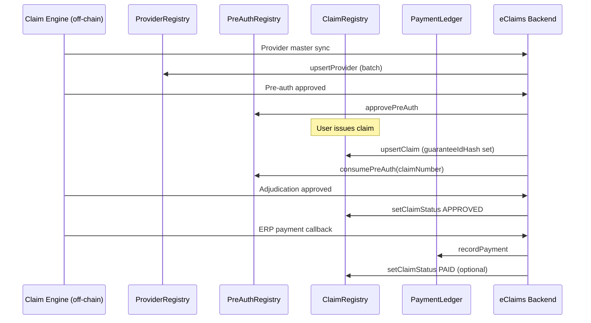

# Blockchain expansion plan — eClaims

This plan maps the **Tier 1 roadmap** (Provider Registry, Pre-Auth, Payment Ledger) to the **existing** `ClaimRegistry.sol`, backend, and frontend. It is based on the current codebase as of the review date.

---

## Current on-chain state (`ClaimRegistry.sol`)

### What exists today

| Area | On-chain | Used by demo app |
|------|----------|------------------|
| **Claims** | Full `Claim` struct, `upsertClaim`, status updates, events | **Yes** — Issue claim (`upsertClaim`), list/search via backend |
| **Patients** | Full `Patient` struct, `upsertPatient`, reads | **No** — contract ready; no frontend/API module |
| **Provider** | Only `providerNameHash` + `providerLevelHash` **inside** each claim | Partial — hashes at issue time; no registry |
| **Pre-auth** | Only `guaranteeIdHash` **inside** each claim | **No** — hash field unused in issue-claim UI |
| **Payment** | `approvedTotal`, `adjustment`, status `SENT_FOR_PAYMENT_PROCESSING` | **No** — no disbursement record on-chain |

### Design patterns already in the contract

- **Hashed strings** via `keccak256(utf8)` — same as frontend (`viem`) and backend (`ethers`).
- **Primary keys:** `claimNumber` (uint256), `claimIdHash` (bytes32), `crIdHash` for patients.
- **Owner-only** writes and most reads (`onlyOwner`) — backend uses `OWNER_ADDRESS` / `OWNER_PRIVATE_KEY`.
- **Events** for indexers: `ClaimUpserted`, `ClaimStatusUpdated`, `PatientUpserted`, etc.
- **Off-chain display cache:** `POST /api/public/eclaim-contract/meta` + `claim-meta.json`.

### Gaps the roadmap addresses

1. Claims reference providers by hash but **nothing attests** the provider is licensed/active.
2. `guaranteeIdHash` is a **downstream field** with no upstream PreAuth record.
3. Approval stops at status/amounts — **no proof of payment** on-chain.

---

## Architecture decision

### Recommendation: **three new contracts + thin updates to ClaimRegistry**

| Contract | Rationale |
|----------|-----------|
| `ProviderRegistry.sol` | Independent lifecycle (register, suspend, level change); many claims reference one provider. |
| `PreAuthRegistry.sol` | Authorizations exist **before** claims; own status and expiry. |
| `PaymentLedger.sol` | Append-only disbursement log; avoids bloating `Claim` struct. |

Keep **`ClaimRegistry`** as the claim anchor. Add **optional validation hooks** in a later phase (see Phase 3).

Alternative (not recommended for v1): one monolithic `EClaimsRegistry.sol` — harder to upgrade, deploy, and permission per domain.

### Shared infrastructure

- Same **owner** (SHA multisig) or **role-based** access (OpenZeppelin `AccessControl`) across all four contracts.
- Same **hashing** convention: `hashString(s)` / client-side `keccak256(stringToBytes(s))`.
- Single **Nest module** `eclaim-contract` extended (or split into `eclaim-provider`, `eclaim-preauth`, `eclaim-payments`) with one RPC provider and owner signer.
- **Indexer / backend** continues event-driven discovery (like `ClaimUpserted` today).

---

## Tier 1 — Feature designs

### 1. Provider Registry (`ProviderRegistry.sol`)

#### Purpose

Anchor **authorised providers** so claims can be checked against license, level, and active status.

#### Suggested struct

```solidity
struct Provider {
    bytes32 providerIdHash;      // e.g. FID / facility code (key)
    bytes32 nameHash;
    bytes32 levelHash;           // LEVEL 4, etc.
    bytes32 countyHash;
    bytes32 facilityTypeHash;
    uint64 licenseValidFrom;
    uint64 licenseValidTo;
    bool active;
    bool suspended;
}
```

#### Core functions

| Function | Access | Notes |
|----------|--------|-------|
| `upsertProvider(Provider)` | Owner / Registrar role | Register or update |
| `setProviderActive(providerIdHash, bool)` | Owner | De-register / reinstate |
| `setProviderLevel(providerIdHash, bytes32 levelHash)` | Owner | Tier changes |
| `getProvider(providerIdHash)` | View | For auditors |
| `isProviderActiveAt(providerIdHash, uint64 timestamp)` | View | Used by claim validation |

#### Events

- `ProviderRegistered`, `ProviderUpdated`, `ProviderSuspended`, `ProviderLevelChanged`

#### Link to claims

- On **issue claim**, compute `providerIdHash` from facility code (align with QA API `fidCode` / provider master).
- **Phase 1:** store hashes only (as today).
- **Phase 3:** `ClaimRegistry._upsertClaim` requires `ProviderRegistry.isProviderActiveAt(providerIdHash, creationDate)` when `providerIdHash != 0`.

#### Backend / app

| Layer | Work |
|-------|------|
| **Contract** | New file + deploy script |
| **Backend** | Sync from Claim Engine `GET /master/provider/*` → batch `upsertProvider`; new endpoints `GET /public/eclaim-contract/provider/:id` |
| **Frontend** | Optional admin screen; issue-claim dropdown from provider list |
| **Meta** | Plaintext provider name in off-chain cache (same pattern as claims) |

#### Alignment with QA Claim Engine

- Source of truth for providers: **`/master/provider`**, **`/hie/facility`**
- Periodic job: diff provider master → on-chain upsert (owner-signed batch).

---

### 2. Pre-Authorization registry (`PreAuthRegistry.sol`)

#### Purpose

Record **guarantee / pre-auth** before a claim consumes it.

#### Suggested struct

```solidity
enum PreAuthStatus { REQUESTED, APPROVED, REJECTED, EXPIRED, CONSUMED }

struct PreAuth {
    bytes32 guaranteeIdHash;     // key (UUID / guarantee ref)
    bytes32 providerIdHash;
    bytes32 patientCrIdHash;
    bytes32 procedureOrPackageHash;
    uint256 authorizedAmount;
    uint64 requestedAt;
    uint64 approvedAt;
    uint64 validFrom;
    uint64 validTo;
    PreAuthStatus status;
    uint256 consumedByClaimNumber; // 0 until linked
}
```

#### Core functions

| Function | Access | Notes |
|----------|--------|-------|
| `requestPreAuth(PreAuth)` | Owner or Provider role | Status = REQUESTED |
| `approvePreAuth(guaranteeIdHash, amount, validTo)` | Owner / Approver | |
| `rejectPreAuth(guaranteeIdHash, bytes32 reasonHash)` | Owner | |
| `expirePreAuth(guaranteeIdHash)` | Owner or anyone after `validTo` | |
| `consumePreAuth(guaranteeIdHash, uint256 claimNumber)` | Owner | Sets CONSUMED + claim link; one-time |
| `getPreAuth(guaranteeIdHash)` | View | |

#### Events

- `PreAuthRequested`, `PreAuthApproved`, `PreAuthRejected`, `PreAuthConsumed`, `PreAuthExpired`

#### Link to claims

- Issue claim UI: optional **Guarantee ID** field → `guaranteeIdHash` on `Claim` (already in struct).
- **Phase 2:** backend on claim upsert calls `consumePreAuth` when status moves to submitted.
- **Phase 3:** `ClaimRegistry` rejects upsert if `guaranteeIdHash != 0` and pre-auth not APPROVED or expired.

#### Backend / app

| Layer | Work |
|-------|------|
| **Contract** | New file + deploy |
| **Backend** | Webhook/cron from Claim Engine predetermination / pre-auth APIs (`/claim/predetermination/*`, adjudication pre-auth) |
| **Frontend** | Pre-auth request status page; link guarantee ID when issuing claim |
| **Search** | `POST /search` by `guaranteeIdHash` via events |

#### Alignment with QA Claim Engine

- **`POST /claim/{claimId}/adjudicate-preauth`**
- **`GET /claim/predeterminationLog/{claimId}`**
- Map guarantee UUID → `guaranteeIdHash` on Spearhead when approved.

---

### 3. Payment settlement ledger (`PaymentLedger.sol`)

#### Purpose

Immutable **disbursement record** after claim approval — closes authorization → claim → **payment** loop.

#### Suggested struct

```solidity
struct Payment {
    uint256 paymentId;           // auto-increment
    uint256 claimNumber;
    bytes32 providerIdHash;
    uint256 amount;
    bytes32 paymentReferenceHash; // ERP / bank ref
    bytes32 currencyHash;         // e.g. "KES"
    uint64 paidAt;
    bool reversed;
}
```

#### Core functions

| Function | Access | Notes |
|----------|--------|-------|
| `recordPayment(claimNumber, providerIdHash, amount, paymentReferenceHash, paidAt)` | Owner / Treasury role | Append-only; emit event |
| `reversePayment(paymentId, bytes32 reasonHash)` | Owner | Soft reversal flag; do not delete |
| `getPayment(paymentId)` | View | |
| `getPaymentsByClaim(claimNumber)` | View | Or index via events only |
| `totalPaidForClaim(claimNumber)` | View | Sum non-reversed |

#### Events

- `PaymentRecorded` (indexed: `claimNumber`, `providerIdHash`, `paymentId`)
- `PaymentReversed`

#### Link to claims

- When Claim Engine marks paid (`/wf/paidStatus/update`, `/payments/claim/{claimId}`):
  1. Update claim status → `SENT_FOR_PAYMENT_PROCESSING` or final paid state (may need new enum value `PAID`).
  2. Call `PaymentLedger.recordPayment` with ERP reference.
- Optionally add `ClaimRegistry.setClaimStatus(..., PAID)` in same backend transaction batch.

#### Backend / app

| Layer | Work |
|-------|------|
| **Contract** | New file; consider `PAID` in `Status` enum (requires ClaimRegistry redeploy or new contract version) |
| **Backend** | Listener on payment callbacks (`/payments/callback/erp`) → on-chain `recordPayment` |
| **Frontend** | Claim detail: show tx hash + payment reference from chain |
| **Audit** | Export payment events + claim status timeline |

#### Alignment with QA Claim Engine

- **`GET /payments/claim/{claimId}`**
- **`POST /payments/callback/erp`**
- **`POST /wf/paidStatus/update`**

---

## Cross-contract flow (target end state)



---

## Implementation phases

### Phase 0 — Foundation (1–2 weeks)

- [ ] Decide **access model**: single `owner` vs `AccessControl` (Registrar, Approver, Treasury).
- [ ] Add **`docs/network-and-contract-reference.md`** entries for each new deployment address.
- [ ] Extract shared **`IHashUtils`** or library for `keccak256(bytes(s))`.
- [ ] CI: `hardhat compile` + basic tests per contract.
- [ ] Backend: env vars `PROVIDER_REGISTRY_ADDRESS`, `PREAUTH_REGISTRY_ADDRESS`, `PAYMENT_LEDGER_ADDRESS`.

### Phase 1 — Provider Registry (2–3 weeks)

- [ ] Implement `ProviderRegistry.sol` + tests (register, suspend, level change, expiry).
- [ ] Deploy to Spearhead QA; verify on explorer.
- [ ] Backend: `provider-registry.service.ts` — sync job from Claim Engine provider API (manual trigger first).
- [ ] Optional: admin API `POST /public/eclaim-contract/providers/sync`.
- [ ] **No change** to `ClaimRegistry` yet — claims still store hashes only.

### Phase 2 — Pre-Auth Registry (2–3 weeks)

- [ ] Implement `PreAuthRegistry.sol` + tests (approve, expire, consume once).
- [ ] Backend: map predetermination / guarantee IDs from Claim Engine.
- [ ] Frontend: optional guarantee ID on issue-claim; validate via API before MetaMask tx.
- [ ] On successful claim issue: backend `consumePreAuth` + existing `/meta` POST.

### Phase 3 — Claim validation hooks (1–2 weeks)

- [ ] Add **optional** checks in `ClaimRegistry._upsertClaim`:
  - If `providerIdHash` present → provider active.
  - If `guaranteeIdHash` present → pre-auth approved and not consumed.
- [ ] Requires redeploy `ClaimRegistry` or new version contract; migrate addresses in frontend/backend.

### Phase 4 — Payment Ledger (2–3 weeks)

- [ ] Implement `PaymentLedger.sol` + tests (record, reverse, idempotency by `paymentReferenceHash`).
- [ ] Extend `Status` enum with `PAID` (or use off-chain mapping payment exists → “paid” in API).
- [ ] Backend: hook ERP payment callback → `recordPayment` + update claim status.
- [ ] Frontend: payment proof on claim detail / search results.

### Phase 5 — Hardening & ops

- [ ] Multisig ownership transfer for all contracts.
- [ ] Monitoring: failed sync jobs, unconsumed pre-auths, claims without payment.
- [ ] GitBook: user + technical pages per registry.
- [ ] Load test batch `upsertProviders` / `upsertClaims` on Spearhead.

---

## ClaimRegistry changes (minimal diff summary)

| Change | When | Risk |
|--------|------|------|
| Add `providerIdHash` field to `Claim` (separate from name hash) | Phase 1 | Medium — struct layout change → **new deploy** |
| Validate provider/pre-auth in `_upsertClaim` | Phase 3 | Low if optional flag `strictValidation` |
| Add `PAID` to `Status` enum | Phase 4 | Medium — enum extension, redeploy |
| Store `paymentId` on claim | Optional | Prefer ledger lookup by `claimNumber` instead |

**Prefer:** keep `Claim` struct stable; use **events + mappings** in satellite contracts keyed by `claimNumber` / `guaranteeIdHash`.

---

## Backend module sketch

```
eclaim-backend/src/
  eclaim-contract/           # existing ClaimRegistry
  eclaim-provider/           # ProviderRegistry service + controller
  eclaim-preauth/            # PreAuthRegistry
  eclaim-payment-ledger/     # PaymentLedger
  eclaim-sync/               # Claim Engine → chain jobs (shared)
```

Shared:

- `chain.config.ts` — addresses, RPC, owner signer
- `hash.util.ts` — `h(string)` matching Solidity
- `event-scanner.util.ts` — chunked `queryFilter` (reuse from `getAllClaims`)

---

## Frontend sketch

| Feature | UI |
|---------|-----|
| Providers | Admin-only list (active/suspended); read-only for auditors |
| Pre-auth | Status lookup by guarantee ID |
| Issue claim | Provider picker (FID), optional guarantee ID |
| Search / list | Columns: pre-auth status, payment ref, explorer links |
| Payments | Show `PaymentRecorded` tx on approved claims |

---

## What else could move on-chain later (Tier 2+)

| Entity | Motivation |
|--------|------------|
| **Adjudication decisions** | Hash of decision + reviewer role + timestamp |
| **Document attestations** | Merkle root of claim documents (`documents/{claimId}`) |
| **Scheme / benefit rules** | Hash of benefit version used at adjudication |
| **Surveillance flags** | Already `surveillanceStatus` on claim — expose workflows |
| **Bulk approval batches** | Batch ID on-chain matching Claim Engine bulk approve |

---

## Risks and mitigations

| Risk | Mitigation |
|------|------------|
| Claim Engine remains source of truth; chain lags | Sync jobs + reconciliation reports |
| `onlyOwner` centralization | Multisig + role separation per contract |
| PII on-chain | Continue **hash-only** on-chain; plaintext in secured off-chain store |
| Struct changes break demo | Version contracts (`ClaimRegistryV2`) instead of mutating |
| Gas / Spearhead costs | Batch upserts; L3 settlement per ADI docs |

---

## Success criteria

1. **Provider:** Inactive provider cannot pass validation when strict mode enabled.
2. **Pre-auth:** Each `guaranteeIdHash` consumed by at most one `claimNumber`.
3. **Payment:** Every ERP disbursement for a claim has matching `PaymentRecorded` event.
4. **Audit:** Third party can reconstruct lifecycle from events only (plus published hashes).

---

## Related docs

- [E-claims project overview](./eclaims-project-overview.md)
- [Network & contract reference](./network-and-contract-reference.md)
- [ADI L3 Chains](https://docs.adi.foundation/adi-network-components/overview-1)
- QA Claim Engine: `https://qa-payers.apeiro-digital.com/api/v1/swagger-ui/`

---

*This is an implementation plan, not a commitment timeline. Adjust phases after a proof-of-concept deploy on Spearhead QA.*
