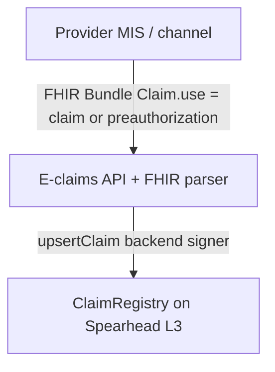
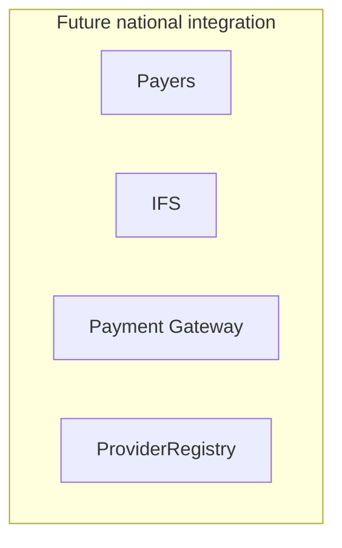
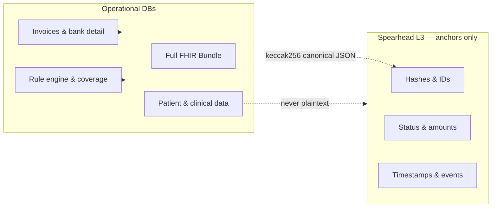
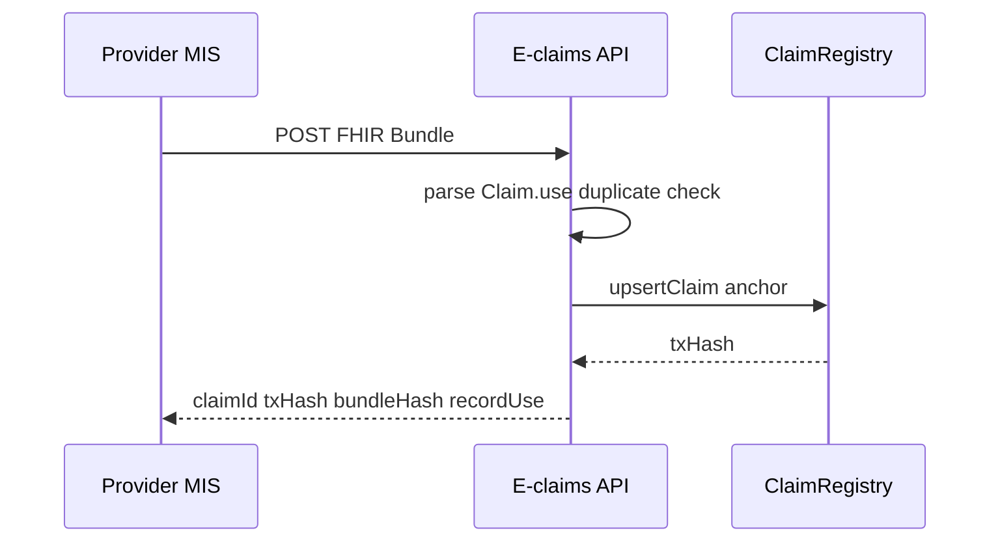
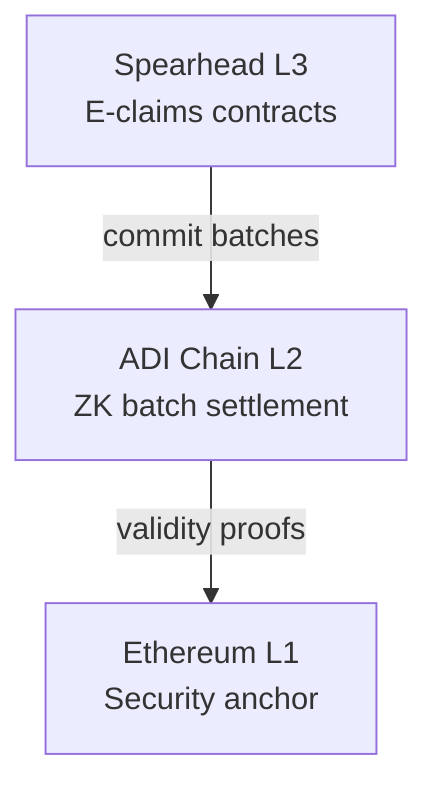
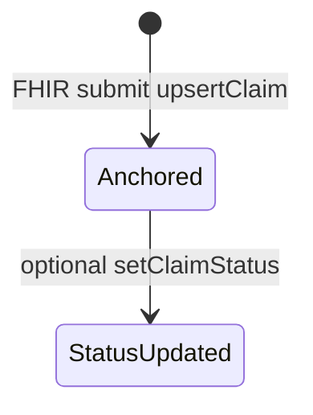

# E-claims Blockchain Whitepaper

**Prepared for:** Social Health Authority (SHA) E-claims programme / ADI Spearhead L3 discussion  
**Version:** 2.0 (aligned with SHA gap analysis + current implementation)  
**Status:** ClaimRegistry-only scope — FHIR submit for claims and pre-authorizations on Spearhead testnet

**Implementation scope:** E-claims uses **ClaimRegistry only**. It receives QA MIS FHIR bundles, anchors hashed fields via backend-signed `upsertClaim`, and does **not** integrate with ProviderRegistry, Payers, or IFS. Claims and pre-auths share the same bundle shape; `Claim.use` distinguishes them. National lifecycle items (adjudication, payment, provider registry) are documented as future phases.

**Word / Google Docs export:** [blockchain-whitepaper-word.md](./blockchain-whitepaper-word.md) — paste-friendly version with ASCII diagrams (no Mermaid).

**Related documents:**
- [Blockchain value proposition](./blockchain-value-proposition.md) — executive narrative
- [FHIR integration mapping](./blockchain-fhir-integration.md) — field-level detail
- [Blockchain integration implementation plan](./blockchain-integration-implementation-plan.md) — delivery phases
- [Network & contract reference](./network-and-contract-reference.md) — Spearhead addresses

---

## 1. Executive Summary

### Problem

Healthcare claims in the SHA ecosystem move across multiple independent systems and organisations — Provider, Payers, IFS, and the Payment Gateway. Each platform maintains its own database, identifiers, audit logs, and version of events. When parties disagree about what was submitted, when it was approved, or whether payment occurred, reconciliation depends on manual cross-matching of siloed records. This creates:

- Duplicate or replayed claims across adjudication cycles
- Claims from unauthorised or expired facilities entering the flow
- Delayed payment disputes and inconclusive audits
- High manual effort for regulators and internal audit teams

### Proposed solution

E-claims introduces a **thin blockchain trust layer** on Spearhead L3. The E-claims platform receives FHIR R4 Bundles, extracts anchor fields (hashes, amounts, dates), and signs `upsertClaim` on Spearhead. Full FHIR payloads, clinical data, and personal health information remain off-chain.

### Technology choice

**Spearhead** operates as an **ADI Layer 3 zero-knowledge rollup chain**. Transactions execute on L3, batches are proved and settled to **ADI Chain (L2)**, and security ultimately anchors to **Ethereum (L1)**. This provides dedicated programme capacity, verifiable execution, and institutional-grade settlement without publishing sensitive payloads on a public ledger.

### Expected outcomes

| Outcome | Status | Description |
|---------|--------|-------------|
| Tamper-evident submission | **Live** | Proof that a claim or pre-auth was lodged with amount and date |
| Duplicate prevention | **Live** | Same claim UUID rejected at intake (`claimIdHash` mapping) |
| Bundle integrity | **Live** | `bundleContentHash` binds full FHIR bundle off-chain |
| Privacy by design | **Live** | No plaintext PHI; hash-only anchoring |
| Pre-auth and claims | **Live** | Same FHIR bundle; `Claim.use` = claim \| preauthorization |
| Provider authorization on-chain | Future | ProviderRegistry — national programme, not E-claims today |
| Adjudication / payment on-chain | Future | Payers / IFS / CPP — national programme |

**Deployed (Spearhead testnet):** `ClaimRegistry` at `0xA8eFbf955496518D6e3Cb10ABC90627671534088`, `POST /api/public/eclaim-contract/submit`, Submit FHIR portal, list/search/duplicate-check APIs.

---

## 2. Background and Problem Statement

### National claims context

The Social Health Authority coordinates a national claims ecosystem where providers deliver services, submit pre-authorizations and claims, and receive payment through a multi-party chain. A single institutional claim may include:

- Facility identity (Facility Identifier — FID)
- Patient beneficiary record (Afyaangu CR id)
- Clinical and intervention detail (diagnosis, items, attachments)
- Dual or multiple coverage (e.g. SHA + PMF)
- Adjudication outcomes and adjustments
- Invoice and bank settlement through ERP and payment gateway

Each system is authoritative for its domain. None holds a record that all parties accept as neutral when disputes arise.

### Concrete pain points

| Pain point | Impact |
|------------|--------|
| **Duplicate claims** | Same claim UUID or bundle resubmitted; difficult to detect across systems |
| **Unauthorised providers** | Facilities not registered, suspended, or outside license period submit claims |
| **Reconciliation delays** | Matching payer claim numbers, invoice ids, and payment refs is manual |
| **Payment disputes** | Proof of approval vs proof of payment held in separate databases |
| **Audit effort** | Investigators reconstruct timelines from heterogeneous logs |
| **Pre-auth abuse** | Guarantee letters reused or not linked to subsequent claims |

### Design response

E-claims addresses these gaps by anchoring **what must be provable** on Spearhead while preserving **what must remain private and rich** in operational databases. The blockchain layer is intentionally thin: hashes, amounts, dates, status, and events — not clinical narratives or bank account detail.

---

## 3. Current E-claims Ecosystem

### System roles

| Component | Mandate | System of record for |
|-----------|---------|----------------------|
| **Provider** | Facility master, FID, claim/pre-auth submission | Hospital records, FHIR bundles, facility identifiers |
| **Payers** | Adjudication, approval, rejection, return | Clinical/policy decisions, claim outcomes |
| **IFS** | ERP, financial operations | Patients, providers, interventions, invoices, payment instructions |
| **Payment Gateway (CPP)** | Settlement execution | Payment transactions, bank disbursement status |
| **E-claims** | Validation, anchoring, handoff | Claim intake orchestration, on-chain anchors, integration APIs |

E-claims sits between these systems. It does not duplicate master data. It adds shared trust and traceability across boundaries.

### National architecture context

The wider SHA architecture also includes MOH oversight, Health Information Exchange (HIE), Afyaangu CR, KMPDC facility registry (FR), Rule Engine, and datalake analytics. E-claims blockchain integration (current scope):
  • FHIR R4 Bundles from provider channel (QA MIS profile)
  • Parse → hash → ClaimRegistry.upsertClaim (backend signer)
  • Claims (Claim.use = claim) and pre-authorizations (Claim.use = preauthorization)
  • No direct read/write to Payers, IFS, or Provider master data

### Current implementation status

| Capability | Status |
|------------|--------|
| Spearhead L3 testnet (chain 99991) | Live |
| `ClaimRegistry.sol` — minimal QA MIS anchor (claim + pre-auth) | Deployed |
| `POST /api/public/eclaim-contract/submit` (FHIR → chain) | Implemented |
| FHIR parser (Bundle → Claim struct) | Implemented |
| Submit FHIR portal (`/submit`) | Implemented |
| GET list / search / duplicate check | Implemented |
| ProviderRegistry / Payers / IFS sync | **Out of scope** |
| PaymentLedger | **Out of scope** |

---

## 4. Why Blockchain

### What a shared ledger adds

A conventional integration bus moves data between systems but does not give independent parties a **neutral, tamper-evident timeline** they can verify without trusting a single vendor database.

Blockchain anchoring provides:

1. **Immutability of recorded events** — status transitions and submission receipts cannot be silently rewritten
2. **Independent verification** — auditors, providers, and partners query Spearhead directly
3. **Deterministic integrity proofs** — bundle content hash binds off-chain FHIR to on-chain anchor
4. **Programme-specific chain** — Spearhead isolates E-claims execution from unrelated workloads

### What blockchain does not do

- Replace Payers as adjudication authority
- Replace IFS as financial system of record
- Store patient names, diagnoses, or full claim payloads on-chain
- Eliminate the need for operational databases and APIs

### Why not a private database alone?

SHA and partners need audit evidence that does not depend on any one organisation's willingness or ability to produce unaltered logs. A hash-anchored L3 record, settled through ADI L2 to Ethereum L1, provides cryptographic proof suitable for institutional dispute resolution and regulatory oversight.

---

## 5. Proposed Architecture

### End-to-end flow (implemented)



E-claims does **not** forward FHIR to Payers or validate against ProviderRegistry in the current implementation.

### Target national flow (future — not E-claims scope today)



### On-chain / off-chain separation



### FHIR submission sequence (implemented)



### L3 → L2 → L1 settlement



**Operational use:** Soft confirmation on L3 within seconds for claim intake and status updates. Stronger assurance builds as batches are proved on L2 and settled on L1, aligned with institutional risk appetite.

---

## 6. ADI Network and Spearhead Layer 3

### Layer model

| Layer | Role | Relevance to E-claims |
|-------|------|------------------------|
| **L3 — Spearhead** | Application execution; E-claims smart contracts | Claim anchors (`ClaimRegistry`) |
| **L2 — ADI Chain** | ZK rollup settlement, shared bridge registry | Batch commitment and validity proofs |
| **L1 — Ethereum** | Ultimate security anchor | Long-term tamper evidence |

Spearhead is a **zero-knowledge rollup**: transactions are ordered and executed on L3, then batched, proved, and settled upward. Sensitive payload data is not required on L1; only state commitments and proofs propagate.

### Spearhead testnet parameters

| Setting | Value |
|---------|--------|
| Network name | Spearhead Testnet |
| Chain ID | `99991` |
| RPC URL | `https://rpc.spearhead.adifoundation.ai` |
| Block explorer | `https://explorer.spearhead.adifoundation.ai/` |
| Native gas token | ADI (18 decimals) |

### Deployed contract (E-claims uses this only)

| Contract | Address |
|----------|---------|
| ClaimRegistry | `0xA8eFbf955496518D6e3Cb10ABC90627671534088` |
| Owner wallet | `0xE8d5A99D3A879C6c9b8A371279b9Da5220C3c362` |

> An earlier ProviderRegistry demo contract exists on testnet but is **not** used by the E-claims FHIR submit path.

Further reading: [ADI Network Components](https://docs.adi.foundation/adi-network-components/overview-1)

---

## 7. On-chain vs Off-chain Data Model

### Classification matrix (QA MIS profile — implemented)

| Data element | Location | On-chain field | In contract |
|--------------|----------|----------------|-------------|
| Full FHIR Bundle JSON | Provider MIS | `bundleContentHash` | Yes |
| Bundle.id | FHIR | `bundleIdHash` | Yes |
| Claim UUID | FHIR | `claimIdHash` | Yes |
| Claim.use (claim / pre-auth) | FHIR | `recordUseHash` | Yes |
| Organization.id (FID) | FHIR | `fidHash` (hashed) | Yes |
| Organization.name | FHIR | — | No (off-chain) |
| Facility level | FHIR extension | `facilityLevelHash` | Yes |
| Coverage schemeCategoryCode | FHIR | `schemeCodeHash` | Yes |
| Patient.id (CR) | FHIR | `crIdHash` (hashed) | Yes |
| Patient national ID | FHIR | `nationalIdHash` (hashed) | Yes |
| Patient name / phone / DOB | FHIR | — | No (off-chain) |
| Claim.type, subType ip | FHIR | `claimTypeHash`, `ipsClaim` | Yes |
| Intervention code | FHIR | `interventionCodeHash` | Yes |
| Claim.total, billablePeriod | FHIR | `claimedTotal`, `dateFrom`, `dateTo` | Yes |
| Claim.created | FHIR | `creationDate` | Yes |
| Diagnosis / attachments | FHIR | — | No (bundle hash only) |
| Adjudication status | Payers | `status` (optional) | Enum; manual API only |
| Provider registry attestation | National master | — | No (future national) |
| Payment / invoice detail | IFS / CPP | — | No (future national) |

### Hashing convention

All string identifiers use:

```text
keccak256(UTF-8 bytes of string)
```

Empty string maps to `0x000…000` (32 zero bytes). Contracts expose `hashString()` for client verification.

**Canonical bundle hash:** Full FHIR bundle is canonicalised (stable key order, UTF-8, normalised dates) before hashing. Specification and test vectors are delivered in Phase 0 of the implementation plan.

---

## 8. Smart Contracts and Access Roles

### 8.1 ClaimRegistry (deployed — QA MIS profile only)

**Purpose:** Anchor claims and pre-authorizations from the institutional FHIR bundle. No Patient struct; no fields outside this profile.

**Required bundle resources:** Bundle, Organization, Coverage, Patient, Claim.

**FHIR → on-chain mapping** (strings hashed except amounts/dates/bools):

| FHIR path | ClaimRegistry field |
|-----------|---------------------|
| Bundle.id | `bundleIdHash` |
| Canonical Bundle JSON | `bundleContentHash` |
| Claim.identifier | `claimIdHash` |
| Claim.use | `recordUseHash` |
| Organization.id (FID) | `fidHash` |
| Organization facility-level | `facilityLevelHash` |
| Coverage schemeCategoryCode | `schemeCodeHash` |
| Patient.id (CR) | `crIdHash` |
| Patient national ID | `nationalIdHash` |
| Claim.type | `claimTypeHash` |
| Claim.item intervention code | `interventionCodeHash` |
| Claim.created | `creationDate` |
| Claim.billablePeriod | `dateFrom`, `dateTo` |
| Claim.total | `claimedTotal` |
| Claim.subType ip | `ipsClaim` |

**Write (owner):** `upsertClaim`, `setClaimStatus`, `setClaimStatusByClaimIdHash`

**Read (owner; exposed via backend APIs):** `getClaim`, `getClaimByClaimIdHash`, `existsClaim`, `hashString`

**Events:** `ClaimUpserted`, `ClaimStatusUpdated`

**Duplicate prevention:** `claimIdHash` → `claimNumber` mapping; second submit reverts.

### 8.2 Access control (implemented)

| Role | Permission |
|------|------------|
| E-claims backend signer | `upsertClaim`, `setClaimStatus` (`OWNER_PRIVATE_KEY`) |
| Provider / MIS | POST FHIR to `/submit`; no wallet required |
| SHA administrator | Contract owner; gas funding |
| Auditor | Read APIs + block explorer |

### 8.3 Out of scope (gap analysis — national / future)

Not part of current E-claims delivery: **ProviderRegistry**, **PaymentLedger**, Payers webhook sync, IFS approval on-chain, provider wallet gas.

### 8.4 Reference — national contracts (future)

<details>
<summary>ProviderRegistry, PreAuthRegistry, PaymentLedger (not deployed for E-claims)</summary>

These appear in the SHA gap analysis for the wider national programme. E-claims does not call them today.

</details>

---

## 9. End-to-End Record Lifecycle

### Implemented lifecycle (today)



1. Provider MIS sends FHIR Bundle (`Claim.use` = claim or preauthorization)
2. E-claims parses, duplicate-checks, calls `upsertClaim` (status = UNKNOWN)
3. Optional: `POST .../status` → `setClaimStatus` (manual / ops)

### National lifecycle (reference — not automated by E-claims)

Gap analysis target: Submitted → Validated → Adjudicated → Approved/Rejected → Sent to IFS → Payment Initiated → Settled. E-claims anchors the **submission** step only.

---

## 10. Privacy and Compliance

### Principles

1. **No PHI on-chain** — Patient names, clinical narratives, and contact detail never appear in plaintext on Spearhead.
2. **Hash-only anchoring** — Identifiers such as CR id and national ID are stored as one-way hashes when needed for correlation.
3. **Data minimisation** — Only fields required for integrity, authorisation, and audit are anchored.
4. **Operational encryption** — Sensitive data in Provider, Payers, and IFS remains encrypted and access-controlled per existing SHA policies.
5. **Attachments off-chain** — PDFs and supporting documents stay in accredited document stores; bundle hash proves inclusion.

### Compliance alignment

| Topic | Approach |
|-------|----------|
| Health data protection | PHI in accredited systems only; chain holds no reversible patient identity |
| Audit rights | Regulators access off-chain systems under existing mandates; chain provides independent timeline |
| Retention | Off-chain retention follows SHA / MOH policy; on-chain anchors are permanent audit evidence |
| Right to erasure | Personal data erasure applies to operational DBs; on-chain hashes are not reversible to identity |
| Cross-border | Spearhead L3 dedicated to SHA programme; settlement via ADI/Ethereum infrastructure |

### Privacy review checkpoint

Phase 0 of implementation requires formal sign-off that no FHIR parser path writes plaintext PII to chain transactions.

---

## 11. Security and Governance

### 11.1 Governance — implemented vs proposed

| Topic | Current (testnet) | Proposed (production / national) |
|-------|-------------------|----------------------------------|
| Spearhead operation | ADI Foundation testnet | SHA programme governance with ADI |
| Contract owner | Single backend wallet | Multisig or HSM-backed SHA admin |
| Provider onboarding on-chain | Not implemented | National ProviderRegistry |
| Contract upgrades | Redeploy + address update | SHA board + audit + migration runbook |
| Emergency pause | Not implemented | Owner pause or circuit breaker |
| Regulator access | Read APIs + explorer | Dedicated auditor APIs |

### 11.2 Security — implemented vs target

| Control | Status |
|---------|--------|
| Backend-signed chain writes | Implemented |
| Provider wallets | Not required (sponsored gas) |
| API authentication | Harden for production |
| mTLS to Payers/IFS | N/A — no integration yet |
| Key management (HSM/KMS) | Target for production |
| Smart contract audit | Planned before mainnet |
| Gas balance monitoring | Implemented (pre-submit check) |

### 11.3 Trust assumptions (current)

- E-claims backend correctly parses FHIR and computes `bundleContentHash`
- Owner key custodied securely (testnet: env variable)
- FID in bundle is **not** validated against national facility register on-chain
- Status updates are manual unless future Payers integration is added

---

## 12. Integration Model

### API integration (implemented)

| Integration | Direction | Mechanism |
|-------------|-----------|-----------|
| Provider channel → E-claims | Inbound | `POST /api/public/eclaim-contract/submit` (FHIR Bundle) |
| E-claims → ClaimRegistry | On-chain | `upsertClaim` (backend signer) |
| E-claims → Portal / auditors | Read | GET list, GET by number, POST search, POST check-duplicate |

### Existing backend endpoints

| Endpoint | Purpose |
|----------|---------|
| `POST /api/public/eclaim-contract/submit` | FHIR Bundle → anchor on chain |
| `GET /api/public/eclaim-contract?recordUse=` | List claims or pre-auths |
| `GET /api/public/eclaim-contract/:claimNumber` | Claim read |
| `POST /api/public/eclaim-contract/search` | Search by claim id |
| `POST /api/public/eclaim-contract/check-duplicate` | Duplicate claim id check |
| `POST /api/public/eclaim-contract/:n/status` | Update status (owner signer) |

### Error handling (implemented)

| Scenario | Behaviour |
|----------|-----------|
| Invalid FHIR / missing resources | 400 from parser before chain write |
| Duplicate claimId on chain | Reject with duplicate error |
| Insufficient gas on signer | 500 with balance message |

---

## 13. Performance and Cost Model

### Volume assumptions (indicative — to be confirmed with SHA)

| Metric | Current implementation |
|--------|------------------------|
| Transactions per FHIR submit | 1 (`upsertClaim`) |
| Full national lifecycle (future) | 3–5 when Payers/IFS sync added |

### Performance (measured on testnet)

| Metric | Observed / target |
|--------|-------------------|
| L3 soft confirmation | Seconds |
| Gas per `upsertClaim` | ~0.26 ADI at ~552 gwei (varies) |
| API latency (submit + chain) | Target under 10 seconds p95 |

### Gas and fee model

| Topic | Policy |
|-------|--------|
| **Who pays gas?** | SHA sponsors gas via E-claims backend signer — providers do **not** require wallets in production |
| **Provider wallets** | Optional for demo portal only; not required for MIS integration |
| **Cost per claim anchor** | Low on L3; exact cost TBD from testnet metering — budgeted by SHA programme |
| **Optimisation** | Hash-only struct; single `upsertClaim` per submit |
| **Sponsored gas** | Backend maintains funded signer account with monitoring and auto-alert |

### Storage growth

On-chain storage grows with claim volume × anchor fields. Hashes are fixed 32 bytes each. Historical events are log-based (cheaper than storage). Archival strategy: chain state permanent; E-claims indexer may aggregate old events for reporting APIs.

---

## 14. Stakeholder Benefits

| Stakeholder | Benefit |
|-------------|---------|
| **Providers** | Durable submission receipt; fair dispute resolution; faster return when sent back |
| **Payers** | Intake validation against authorised facilities; shared decision timeline |
| **IFS** | Align invoices and payments with independent settlement trail |
| **Payment Gateway** | Confirm payment instruction matches previously approved anchored claim |
| **SHA / regulators** | Verifiable cross-chain audit view without consolidating PHI on ledger |
| **Patients / beneficiaries** | Stronger fraud controls; personal data stays in accredited systems |

---

## 15. Implementation Roadmap

| Phase | Focus | Status |
|-------|-------|--------|
| **1** | ClaimRegistry minimal + FHIR submit API | **DONE** (testnet) |
| **1b** | Submit FHIR portal + duplicate check | **DONE** |
| **2** | Production hardening (auth, KMS, audit) | Next |
| **3** | Payers adjudication sync (national) | Future — not E-claims scope today |
| **4** | IFS / payment settlement anchor (national) | Future |
| **5** | ProviderRegistry on-chain (national) | Future |
| **6** | Regulator dashboards, event indexer | Planned |
| **7** | Fraud analytics, reconciliation | Planned |

E-claims has delivered Phase 1. National integration depends on Payers, IFS, and SHA governance agreements.

Detail: [blockchain-integration-implementation-plan.md](./blockchain-integration-implementation-plan.md)

---

## 16. Risks and Mitigations

| Risk | Impact | Mitigation |
|------|--------|------------|
| Wrong bundle hash | Audit proof may not match record | Canonical JSON hashing; parser unit tests |
| FID not validated on-chain | Unauthorised facility id in bundle | Future national registry; off-chain validation today |
| Payers/IFS not integrated | Incomplete lifecycle on chain | Document scope; status enum ready for future |
| Smart contract defect | Blocked or wrong anchors | Testnet pilot; external audit before production |
| Privacy leakage | Regulatory risk | Hash-only model; no PHI in struct |
| Gas/fee uncertainty | Budget / ops risk | SHA-sponsored signer; balance pre-check |
| Governance (single owner) | Key compromise | Multisig + HSM for production |
| Duplicate claim replay | Double anchor attempt | `claimIdHash` mapping reverts duplicate |

---

## 17. KPIs and Success Metrics

| KPI | Applies now | Measurement |
|-----|-------------|-------------|
| Duplicate claims prevented at intake | Yes | check-duplicate / submit reject count |
| Average anchor transaction cost | Yes | ~0.26 ADI per `upsertClaim` (testnet) |
| Average confirmation time | Yes | Submit API including chain receipt |
| Zero PII on-chain | Yes | Struct + parser review |
| Lifecycle anchoring completeness | Partial | 100% submit; adjudication/pay = future |
| Unauthorised provider blocks | Future | Requires ProviderRegistry |
| Claim reconciliation time | Future | Baseline TBD with SHA |
| Payers–chain status match rate | Future | Requires Payers webhook |

---

## 18. Conclusion

The SHA E-claims programme introduces a thin blockchain trust layer on Spearhead L3 that anchors institutional claims and pre-authorizations from QA MIS FHIR bundles. Sensitive clinical and personal data remain off-chain; the ledger stores hashes, amounts, dates, and optional status.

**Current implementation (testnet):** minimal `ClaimRegistry`, FHIR submit API, backend-sponsored gas, duplicate prevention, and portal tooling. This satisfies the core gap-analysis items for architecture, data model, smart contract specification, privacy, integration, and cost model for the **submission anchor phase**.

National programme items from the gap analysis — ProviderRegistry, Payers adjudication sync, IFS payment proof, full lifecycle, regulator dashboards — are **future phases** owned by the wider SHA ecosystem.

**Recommended next steps:**

1. SHA workshop: production governance, gas budget, API authentication.
2. Privacy sign-off on hash-only model and FHIR parser paths.
3. Smart contract audit before production cutover.
4. Agree national integration roadmap with Payers / IFS when anchoring beyond submit is required.

---

## Appendix A — Gap analysis completion checklist

| Gap analysis item | Whitepaper § | Implementation status |
|-------------------|--------------|----------------------|
| Executive summary | 1 | Complete |
| Detailed problem statement | 2 | Complete (national context) |
| Architecture diagrams | 5, 6 | Complete |
| On-chain vs off-chain data model | 7 | Complete (QA MIS profile) |
| Smart contract specification | 8 | Complete (ClaimRegistry only) |
| Governance model | 11 | Partial — proposed for production |
| Security model | 11 | Partial — testnet implemented |
| Privacy and compliance | 10 | Complete |
| Integration model | 12 | Complete (FHIR submit path) |
| Gas and fee model | 13 | Complete (sponsored gas; ~0.26 ADI measured) |
| Performance and scalability | 13 | Partial — submit path measured |
| Implementation roadmap | 15 | Complete (Phase 1 done) |
| Risks and mitigations | 16 | Complete |
| KPIs | 17 | Partial — submit KPIs live |
| ProviderRegistry | 8.3 | **Out of scope** for E-claims |
| Payment / IFS settlement | 7, 9 | Future national programme |
| Full lifecycle automation | 9 | Future — submit only today |

## Appendix B — Document history

| Version | Date | Author | Notes |
|---------|------|--------|-------|
| 1.0 draft | 2026-06-05 | E-claims programme | Initial institutional whitepaper |
| 2.0 | 2026-06-05 | E-claims programme | Gap analysis alignment; ClaimRegistry-only scope |
